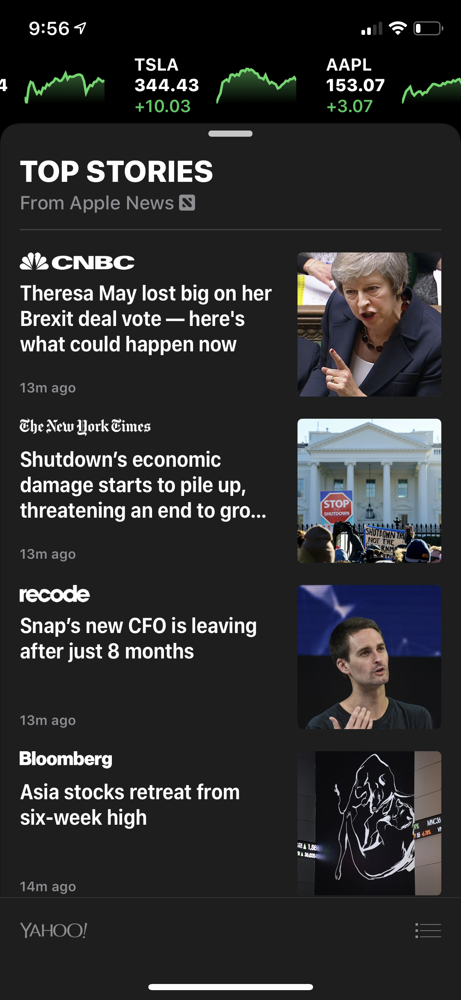

## React Native SwipeUp ScrollView

A very cool scrollview that reproduces the iOS Stocks App popup view.

#### Demo

#### Inspiration

It can also be seen in Apple Maps and other stock iOS apps.

#### Props

| Prop            |               Default               |   Type    | Description                                                                                       |
| :-------------- | :---------------------------------: | :-------: | :------------------------------------------------------------------------------------------------ |
| stops           | [100, 400, `Dimensions.Height-100`] |  `array`  | The snap points at which the modal will come to rest. Recommend at most three, two works as well. |
| topCornerRadius |                 20                  | `number`  | The corner radius applied to the top left and top right corners of the wrapper.                   |
| showTopButton   |                true                 | `boolean` | Controls whether to show the tiny button up top.                                                  |
| topButtonStyle  |                null                 | `object`  | Customize the style of the top button. Currently it is a low opacity 'black' with a pill shape.   |
| wrapperStyle    |                null                 | `object`  | Customize the style of the animated view (wrapper) that contains the actual scrollview.           |

#### Scroll View

As of version 0.2.0, the `style` prop will be passed on to the main scrollview as well.

The main view is a React Native scrollview, so you can customize it using any scrollview props.
